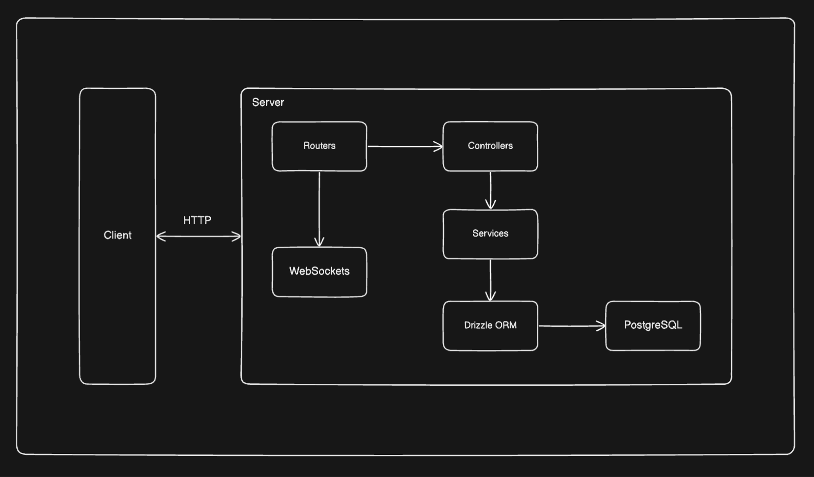
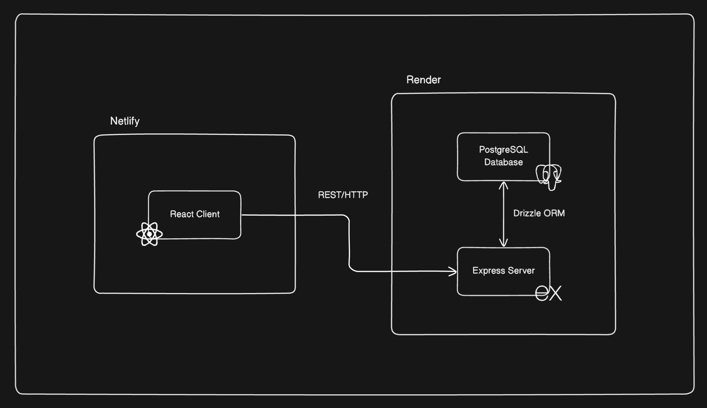

# PeerSphere

## Architecture

### Backend

### Overall

## Inspiration
Our inspiration for PeerSphere came from recognizing the untapped potential of peer-to-peer learning in higher education. We believe that students have a wealth of knowledge and expertise to share with each other, beyond what is available through traditional faculty and teaching assistants. By creating a platform that connects students across universities for 1-on-1 tutoring sessions and open thread discussions, we aim to foster a vibrant community of learners helping learners. PeerSphere empowers students to take ownership of their education and benefit from the diverse perspectives and skills of their peers nationwide. Recognizing that students often learn effectively from their peers, PeerSphere seeks to harness the collective knowledge and skills of students across different universities.

## What it does
PeerSphere is a dynamic web-application designed to facilitate peer-to-peer tutoring and collaborative learning among students from various educational institutions. It allows students, professors and teaching assistants all over the United States to sign up as tutors to provide one-on-one, office-hour style sessions on specific academic concepts. It leverages cutting-edge technology to enhance the learning experience through its advanced video calling feature, which is at the heart of its one-on-one tutoring sessions. It also offers an in-meeting chat option with the instructor. The platform also includes open thread discussions, where students can engage in broader conversations, ask questions, and share resources related to their studies. This structure not only enhances accessibility to diverse educational support but also cultivates a rich learning environment where students can both teach and learn in a mutually beneficial setting. By leveraging the collective knowledge of students across various institutions, PeerSphere breaks down traditional barriers and expands access to valuable educational resources beyond the confines of a single university.

## How we built it
PeerSphere is a full-stack web application utilizing React Vite for the frontend, Express for the backend, and PostgreSQL for the database. We utilized WebRTC and WebSockets for the video calling and chatting, respectively. JWT and bcrypt were used for authorization and authentication. All of the code was written in TypeScript. Several other tools such as Drizzle ORM, React Query, and Joi were used to facilitate development flow.

We first ideated and designed our website on Excalidraw. We then began work separately using Git version control, and built everything little by little until we were satisfied.

We then hosted the site completely on Render. I love Render.

## Challenges we ran into
Our team had a mix of experience and inexperience, thus making it difficult to distribute work initially. However, as the hackathon continued, we slowly managed to develop a good workflow where the inexperienced members worked on UI/UX and ideating while the experienced members worked more on development.

A notable challenge was the use of WebRTC to create a seamless video call experience. Doing the basics, where you copy and paste one user id to call the other, was simple enough. The true challenge was circumventing this inconvenience, which took a while to figure out.

Another obstacle was global state management, since we chose to use Redux instead of useReducer + createContext for a change. But we figured that out as well.

Hosting was also quite the challenge, for the smallest reasons possible. CORS was acting funny for a while, for example. We managed to figure it out by the end, though!

## Accomplishments that we're proud of
We’re proud of creating a full-stack application that consists of many moving parts. The database, client, server… it requires a certain amount of thought to get everything working in such a short amount of time, if I can say so myself.

Of course, getting WebRTC to work was cool, too.

## What we learned
Developing PeerSphere has been a profound learning experience for our team. We delved into the complexities of building a scalable web application that handles real-time video communications—a critical component of our service. We learned to integrate various APIs and technologies to facilitate interactive features like live chat and video calls. Additionally, the project sharpened our skills in user interface design, ensuring that the platform is user-friendly and accessible to students with varying levels of tech proficiency. On a broader scale, we gained insights into the logistical and ethical considerations of creating a platform that handles sensitive user data, emphasizing the importance of privacy and security in educational technologies.

Additionally, we gained valuable insights into the power of peer-to-peer learning and the importance of creating inclusive educational spaces. This experience has reinforced our belief in the transformative potential of technology to enhance education and foster meaningful connections among learners.

## What's next for PeerSphere
Looking ahead, we have ambitious plans to expand and enhance PeerSphere's capabilities. One immediate goal is to introduce AI-driven features, such as a recommendation system that matches students with tutors based on learning preferences and academic strengths. We also plan to partner with universities and educational institutions to seamlessly integrate PeerSphere into their existing learning management systems, making it easier for students to access peer support. Long-term, we envision PeerSphere evolving into a comprehensive educational ecosystem that not only supports academic tutoring but also facilitates career mentoring and professional development. By continuously innovating and adapting to the evolving needs of learners, we strive to make PeerSphere the go-to platform for peer-to-peer learning, empowering students to unlock their full potential and succeed academically.